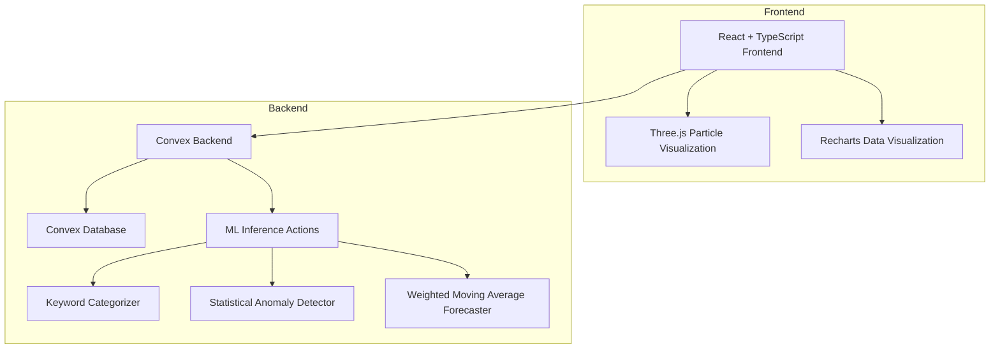

# FinTrack AI

**Intelligent Personal Finance & Student Budget Intelligence System**

A production-quality personal finance platform built for students, young professionals, and individuals who want smart budgeting, expense tracking, and ML-powered financial insights.

## Features

- **Transaction Management** — Add, edit, delete, search, filter, sort, and paginate transactions with CSV import/export
- **Budget Tracking** — Monthly, weekly, semester, and custom budget creation with real-time utilization monitoring
- **Savings Goals** — Track progress toward financial goals with required monthly saving calculations
- **Recurring Expenses & Subscriptions** — Monitor monthly and annualized recurring costs
- **Financial Dashboard** — Real-time overview of income, expenses, savings, and budget usage with interactive charts
- **Analytics** — Deep-dive charts including income vs. expense trends, category breakdown, daily spending, and payment methods
- **AI Insights** — Personalized financial analysis with spending increases, budget warnings, savings tips, and anomaly alerts
- **ML-Powered Categorization** — Automatic expense categorization from transaction descriptions
- **Spending Forecasting** — Predict future spending using historical patterns
- **Budget Overrun Prediction** — Probability-based budget risk assessment
- **Anomaly Detection** — Flag unusual transactions for review
- **Student Mode** — Semester budgets, allowance tracking, and student-specific categories
- **Three.js Visualization** — Solar-magnetic particle visualization on the landing page
- **Authentication** — Email/password auth with Convex backend
- **Data Export** — CSV and JSON export with CSV injection protection
- **Responsive Design** — Desktop, tablet, and mobile layouts
- **Accessibility** — Semantic HTML, keyboard navigation, ARIA labels, proper contrast, reduced-motion support

## Architecture



### Project Structure

```
fintrack-ai/
├── src/
│   ├── components/
│   │   ├── Sidebar.tsx          # Desktop navigation
│   │   ├── MobileNav.tsx        # Mobile navigation
│   │   └── visuals/
│   │       └── ParticlesSwarm.tsx  # Three.js particle visualization
│   ├── pages/
│   │   ├── LandingPage.tsx      # Marketing page with Three.js hero
│   │   ├── AuthPage.tsx         # Login / Register
│   │   ├── OnboardingPage.tsx   # New user setup wizard
│   │   ├── DashboardPage.tsx    # Financial overview
│   │   ├── TransactionsPage.tsx # CRUD + search + import/export
│   │   ├── BudgetsPage.tsx      # Budget management
│   │   ├── SavingsPage.tsx      # Savings goals
│   │   ├── RecurringPage.tsx    # Recurring expenses & subscriptions
│   │   ├── AnalyticsPage.tsx    # Charts and analytics
│   │   ├── InsightsPage.tsx     # AI-powered insights
│   │   ├── ProfilePage.tsx      # User profile
│   │   └── SettingsPage.tsx     # Settings, export, account deletion
│   ├── convex/
│   │   ├── schema.ts            # Database schema (10 tables)
│   │   ├── auth.ts              # Registration, login, profile
│   │   ├── transactions.ts      # Transaction CRUD + filtering
│   │   ├── budgets.ts           # Budget CRUD + spending analysis
│   │   ├── savingsGoals.ts      # Savings goals with contributions
│   │   ├── recurringTransactions.ts  # Recurring expenses
│   │   ├── subscriptions.ts     # Subscription management
│   │   ├── categories.ts        # Category management
│   │   ├── dashboard.ts         # Aggregated dashboard data
│   │   ├── mlInference.ts       # ML inference (categorization, forecasting, anomalies)
│   │   ├── insights.ts          # Financial insights engine
│   │   ├── financialProfiles.ts # User financial profiles
│   │   └── seed.ts              # Demo data seeder (6 months)
│   ├── lib/
│   │   └── utils.ts             # Utilities (currency, dates, CSV export)
│   ├── App.tsx                  # Auth provider + routing
│   ├── main.tsx                 # Entry point (Convex + Query providers)
│   └── index.css                # Design tokens + Tailwind
├── ml/
│   ├── data/
│   │   ├── generate_dataset.py  # Synthetic dataset generator (100K+ records)
│   │   └── validate_dataset.py  # Dataset quality validation
│   ├── training/
│   │   ├── train_classifier.py  # Expense categorization models
│   │   ├── train_forecaster.py  # Spending prediction models
│   │   ├── train_budget_model.py # Budget overrun prediction
│   │   └── train_anomaly_model.py # Anomaly detection
│   └── requirements.txt
├── public/
│   └── favicon.svg
├── package.json
├── vite.config.ts
├── convex.json
└── README.md
```

## Technology Stack

### Frontend
- **React 18** with TypeScript
- **Vite** for fast development and building
- **Tailwind CSS** with shadcn/ui design tokens
- **Recharts** for data visualization (area, bar, pie, radar charts)
- **Three.js** for particle visualization (lazy-loaded, WebGL with fallback)
- **React Router** for client-side routing
- **Convex React** for real-time database queries and mutations
- **Sonner** for toast notifications
- **Lucide React** for icons

### Backend (Convex)
- **10 database tables** with indexes and foreign keys
- **Queries** — Real-time reactive data with filtering
- **Mutations** — CRUD operations with user authorization checks
- **Actions** — ML inference and external integrations
- **Schema validation** via Convex validators

### Machine Learning
- **Python 3** with scikit-learn
- TF-IDF vectorization for text classification
- Isolation Forest for anomaly detection
- Weighted moving average for forecasting
- Multiple model evaluation and selection
- Synthetic dataset generation (100K+ records)

## Getting Started

### Prerequisites
- Node.js 18+
- Bun package manager
- Python 3.8+ (for ML pipeline)
- Convex account (free tier available)

### Frontend Setup

```bash
# Install dependencies
bun install

# Start Convex dev (generates types, starts local backend)
bun convex dev --once

# Start development server
bun run dev
```

### ML Pipeline Setup

```bash
# Navigate to ML directory
cd ml

# Install Python dependencies
pip install -r requirements.txt

# Generate synthetic dataset
python data/generate_dataset.py

# Validate dataset
python data/validate_dataset.py

# Train ML models
python training/train_classifier.py
python training/train_forecaster.py
python training/train_budget_model.py
python training/train_anomaly_model.py
```

### Build & Production

```bash
# Type check
bun tsc -b --noEmit

# Build for production
bun run build

# Preview production build
bun run preview
```

## Environment Variables

| Variable | Description |
|----------|-------------|
| `VITE_CONVEX_URL` | Convex deployment URL (set by `convex dev`) |

## Database Schema

### Tables
- **users** — User accounts with email, password hash, name, type, currency
- **financialProfiles** — Income, occupation, student status, savings targets
- **categories** — System and user-defined transaction categories
- **transactions** — All income/expense records with category, merchant, payment method
- **budgets** — Period-based budgets (weekly, monthly, semester, custom)
- **savingsGoals** — Savings targets with progress tracking
- **recurringTransactions** — Recurring expenses with frequency
- **subscriptions** — Subscription management with billing cycles
- **financialInsights** — Generated insights (spending, budget, anomaly, forecast)

### Key Indexes
- `transactions.by_user_date` — Fast user + date range queries
- `transactions.by_user_type` — Income/expense filtering
- `budgets.by_user_period` — Period-based budget queries
- `financialInsights.by_user_severity` — Severity-filtered insights

## ML Methodology

### Expense Categorizer
- **Approach**: TF-IDF vectorization of transaction descriptions + merchant names
- **Models Evaluated**: Logistic Regression, Linear SVM, Random Forest
- **Selection**: Best model by F1 score on held-out test set
- **Production**: Keyword-based rules for immediate inference; trained models for high-volume processing

### Spending Forecaster
- **Approach**: Weighted moving average with historical spending patterns
- **Features**: Monthly totals, recency weighting, standard deviation for confidence intervals
- **Output**: Predicted amount + confidence range

### Budget Overrun Predictor
- **Approach**: Rule-based with logistic-style probability calculation
- **Features**: Budget utilization rate, time progress, spending rate deviation
- **Priority**: Calibrated probabilities for risk assessment

### Anomaly Detector
- **Approach**: IQR-based statistical detection with z-score calculation
- **Threshold**: 1.5× IQR above Q3 or below Q1
- **Output**: Anomaly list with deviation metrics and review recommendations

### Synthetic Dataset
- **Scale**: 100,000+ transaction records across multiple user profiles
- **Realism**: Probability distributions, rule-based relationships, temporal patterns
- **Patterns**: Weekday/weekend behavior, monthly salary cycles, semester patterns, seasonal spending

## Security

- Password hashing with SHA-256 + salt
- User data isolation (every query/mutation checks user ownership)
- Input validation on all mutations (amount > 0, required fields, valid enums)
- CSV export sanitization (formula injection prevention)
- No secrets in frontend code
- Convex handles auth, CORS, and rate limiting

## Design

- **Color System**: Professional blue primary, semantic success/warning/error colors
- **Typography**: Clean hierarchy with Tailwind's font system
- **Responsive**: Mobile-first with sidebar navigation on desktop
- **Dark Mode**: Full dark mode support via CSS custom properties
- **Loading States**: Skeleton animations for all data-dependent views
- **Empty States**: Contextual messages for empty data
- **Three.js Hero**: Solar-magnetic particle swarm visualization on landing page with:
  - 16,000 adaptive particles
  - Instanced mesh rendering
  - Bloom post-processing
  - ResizeObserver for responsive sizing
  - Reduced-motion detection
  - WebGL fallback to gradient background

## License

MIT License — see [LICENSE](LICENSE) for details.

---

**Disclaimer**: FinTrack AI is a budgeting and financial-analysis tool. It is not a licensed financial advisor or financial institution. All forecasts and insights are estimates based on historical patterns and should not be treated as guaranteed predictions.
